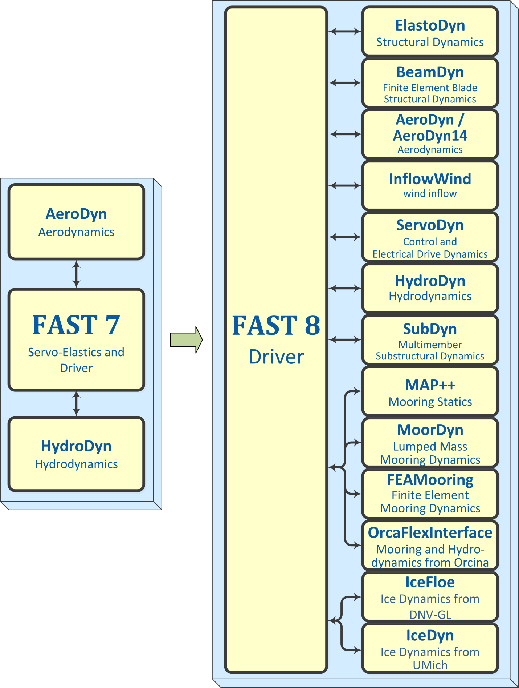

.. _openfast_intro:

Introduction
============

This document is designed to guide you through some of the changes that the OpenFAST wind
turbine multi-physics engineering tool is undergoing, until complete documentation is
made available. OpenFAST v*XXXX* is the latest public release of FAST under the new
modularization framework developed at NREL. The architecture of FAST v8 is entirely
different from FAST v7.02.00d-bjj. These differences are highlighted in Figure 1.

The modules of FAST (AeroDyn, HydroDyn, etc.) correspond to different physical domains
of the coupled aero-hydro-servo-elastic solution, most of which are separated by spatial boundaries.
Figure 2 shows the control volumes associated with each module for fixed-bottom offshore wind turbines.
Though not shown, finite-element blade structural dynamics is optionally available through the
BeamDyn module and loading from surface ice on fixed-bottom offshore wind turbines is optionally
available through the IceFloe or IceDyn modules. For land-based wind turbines, the HydroDyn
hydrodynamics module and ice modules would not be used and the SubDyn multi-member substructure
structural-dynamics module is optional. Figure 3 shows the control volumes associated with each
module for floating offshore wind turbines. Though not shown, finite-element blade structural
dynamics is optionally available through the BeamDyn module and mooring and hydrodynamics are
optionally available through the OrcaFlexInterface module.

   Figure 1: Architectural comparison of FAST 7 and FAST 8

FIGURE 2

FIGURE 3
