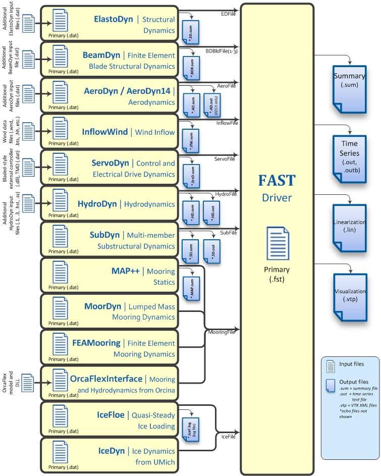

.. _openfast-input:

OpenFAST Input and Output Files
===============================
OpenFAST and each of its modules have their own input files; see Figure 4.

   Figure 4: Summary of Input and Output Files for FAST v8.16.00a-bjj

File Naming Conventions
~~~~~~~~~~~~~~~~~~~~~~~
Input files do not need particular extensions in FAST, though some modules
may make their own assumptions on naming conventions (e.g. OrcaFlex interface).

Output files generated by FAST are named ``<RootName>.<ext>`` and output files
generated by FAST modules are named ``<RootName>.<ModName>.<ext>`` where
<RootName> is the root name of the primary FAST input file (the filename,
including path, without the extension), <ModName> is an abbreviation for the
module generating the file (see Table 2), and <ext> is the file extension.

File extensions currently are:

======================  ============================================  ===========
 Output file extension  File type                                     File format
======================  ============================================  ===========
 sum                    Summary file                                  text
 out                    Time-marching tabular output                  text
 outb                   Time-marching tabular output                  binary
 ech                    Echo of input file (primarily for debugging)  text
 chkp                   Checkpoint files for restart capability       binary
 vtp                    Polygonal data file for visualization         VTK XML (text)
 lin                    Linearization output                          text
======================  ============================================  ===========

When OpenFAST is called as a library from Simulink, the output files are named
``<RootName>.SFunc.<ext>`` and ``<RootName>.SFunc.<ModName>.<ext>``.

Linearization File Naming Convention
------------------------------------
FAST can linearize at multiple times during a simulation (input parameter
NLinTimes). The naming convention for the full-system linearized output
files is ``<RootName>.<LinTimes#>.lin`` and linearized output files generated
by FAST modules are named ``<RootName>.<LinTimes#>.<ModName>.lin`` where
<LinTimes#> is an integer sequentially numbered from 1 to input parameter
NLinTimes.

Visualization File Naming Convention
------------------------------------
When FAST generates visualization files, it generates many .vtp files. There is
one file per mesh per output time step (as specified by input parameter
VTK_fps). Each mesh output will also write an additional mesh showing the
reference configuration at initialization (this mesh name will have the string
"_Reference" appended to it). The naming convention is
``<RootName>.<MeshName>.t<step#>.vtp``.

If an OpenFAST simulation encounters an error when WrVTK > 0, additional files
are output when the program ends. These output files may not be generated at
the exact time step that VTK files would normally be written. They are named
``<RootName>.DebugError.<MeshName>.t<step#>.vtp``.

Checkpoint File Naming Convention
---------------------------------
If FAST generates checkpoint files, these checkpoint filenames are in the form
``<RootName>.<timeStep>.chkp`` where <timeStep> is an integer indicating at
which time step the results in the file were generated. If the simulation was
running a Bladed-style DLL in ServoDyn, there will be a second checkpoint file
named ``<RootName>.<timeStep>.dll.chkp``.

Variables Specified in the OpenFAST Primary Input File
~~~~~~~~~~~~~~~~~~~~~~~~~~~~~~~~~~~~~~~~~~~~~~~~~~~~~~
OpenFAST expects to find variables on specific lines in the text input file,
so, do not add or remove lines in the file. The inputs listed in the file are
described below, and an example file is provided at the end of this document,
in Appendix A: Example FAST v8.16.* Input File.

Simulation Control
------------------
This section of the input file contains options for controlling the simulation.

Echo: Echo input data to <RootName>.ech [T/F]
---------------------------------------------
Setting this flag to **True** will result in the OpenFAST primary input file
being echoed to a file named ``<RootName>.ech`` where <RootName> is the name
of the OpenFAST primary input file, excluding its file extension. This feature
is useful for debugging an input file.

AbortLevel: Error level when simulation should abort ["WARNING", "SEVERE", or "FATAL"]
--------------------------------------------------------------------------------------
This string tells OpenFAST what error level should cause an abort. Typically
we set this to abort on fatal errors, but there may be instances when a user
wishes to abort on severe errors or warnings.

Fatal errors are those from which the program cannot recover. For example:

- Running out of memory when trying to allocate space for variables.
- Trying to read a number from a line of an input file that does not contain
  numeric values.
- Reaching the end of an input file before reading all the necessary
  information.
- Trying to open a file for writing, but the file is locked from another
  process.

Some examples of severe errors include the following:

- A format specifier for real numbers is too narrow to print, so output files
  will almost certainly contain ``***`` instead of actual numbers.
- When trying to read a numeric value, logical "True" or "False" values were
  found instead. Fortran interprets them as 0 or 1, but that may not be what
  the user intended.
- A routine is using math based on the assumption that the angles are small,
  but the angles the routine found were larger than what it considers "small."

Warnings are typically generated when the simulation can continue—perhaps by
the program adjusting inputs—but the results may not be what the user expected.
Things that may generate warnings include

- Cases when user inputs are modified:

 - If the user asked for output on more tower strain gages than there are tower
   nodes, ElastoDyn will set the number of strain gages equal to the number of
   nodes.
 - If air density is set to zero, AeroDyn v14 will turn off the dynamic-inflow
   model.

- Cases where non-physical conditions could be modeled:

 - If the user enables ElastoDyn’s second flap mode but does not enable the
   first flap mode.
 - If the user has disabled wake calculations in AeroDyn.

TMax: Total run time [s]
------------------------
This is the total length of the simulation to be run, in seconds. The first
output is calculated at t = 0; the last output is
calculated at t = TMax seconds.

DT: Recommended module time step [s]
------------------------------------
This is the global, or glue-code, time step; DT is the value FAST will suggest
modules use, although some modules may choose to use a time step that is an
integer multiple smaller than DT. Module input-output relationships used to
couple the modules together are calculated every DT seconds.  It is essential
that a small enough time step is used to ensure solution accuracy (by
providing a sufficient sampling rate to characterize all key frequencies of the
system), to ensure numerical stability of the selected time-integrators, and to
ensure that the coupling between modules of FAST is numerically stable.

Our rule of thumb is to set DT = 1 / (10 * highest natural frequency in Hz of
coupling between modules). This natural frequency is hard to estimate before
the full-system linearization of the coupled FAST model is realized. For
coupled FAST models that don’t use BeamDyn or SubDyn, the frequency can be
estimated via a linearization analysis of FAST v7.  For coupled OpenFAST
models that do use SubDyn, guidance for choosing the time step is found in the
SubDyn ReadMe file.

InterpOrder: Interpolation/Extrapolation order for input/output time history [1 or 2]
-------------------------------------------------------------------------------------
This is the order of the interpolation or extrapolation used for module inputs
in the OpenFAST glue code. Valid entries are "1" for linear
interpolation/extrapolation or "2" for quadratic interpolation/extrapolation.
Previous module inputs are extrapolated at the beginning of each step in the
time-advancement loop to provide a guess for the actual module inputs at future
times for those modules that rely on an implicit time-integrator. Module inputs
are typically interpolated in a module’s UpdateStates routine.

We have found that quadratic extrapolation typically works well. However, there
are times when linear extrapolation provides a stable solution while quadratic
does not. We have found this to be true for cases where the model has poor
initial values or cases where the simulation may have errors building up.

NumCrctn: Number of correction iterations [-]
---------------------------------------------
This is the number of corrections to be taken on each step of the
predictor-corrector scheme implemented in OpenFAST. The value of NumCrctn must
not be negative. Most models can achieve stable solutions by using explicit
calculations (i.e., no corrections: NumCrctn = 0), particularly if using
InterpOrder = 2 and the recommended DT—see above. However, corrections may be
needed if you wish to achieve a given convergence rate of an underlying time
integrator (e.g., if you are using a 4th-order accurate integration scheme, you
may only get a 2nd-order accurate solution with no corrections. If you desire a
4th-order accurate solution, you may need one or more corrections).

DT_UJac: Time between calls to get Jacobians [s]
------------------------------------------------
We use a Jacobian matrix to solve the module input-output relationship between
accelerations and loads in the ElastoDyn-BeamDyn, ElastoDyn-HydroDyn-SubDyn,
and ElastoDyn-OrcaFlexInterface couplings. This Jacobian is computed with
finite differences and can be time consuming. However, it rarely needs to be
calculated frequently.

DT_UJac determines how often the Jacobian needs to be updated. For most models,
DT_UJac can be set to a value larger than TMax. DT_UJac is not currently used
for models that don’t use the BeamDyn, HydroDyn, SubDyn, or OrcaFlexInterface
modules. For floating systems where the platform may rotate more than several
degrees in roll, pitch, and/or yaw, it is recommend to set
DT_UJac = 1/(10*natural frequency in Hz of the roll, pitch, or yaw mode
with excessive motion).

UJacSclFact: Scaling factor used in Jacobians [-]
-------------------------------------------------
This factor is used to divide the magnitude of the load terms in the Jacobian
(see DT_UJac) so that they are approximately the same order of magnitude as the
acceleration terms. We recommend setting UJacSclFact equal to a value roughly
the same order of magnitude as the total system mass in kg. For the NREL 5-MW
turbine models in the Certification Test, we’ve set it to 1E+06 and have not
found any cases where that value did not work. UJacSclFact may need to be set
larger or smaller when modeling wind turbines much larger or smaller turbines
than the NREL 5-MW baseline.

Feature Switches and Flags
~~~~~~~~~~~~~~~~~~~~~~~~~~
This section of the input file contains switches and flags that tell FAST
which modules should be used in the simulation.

CompElast: Compute structural dynamics [1 or 2]
-----------------------------------------------
= ====================================================================================================================
1 Use ElastoDyn for the structural dynamics of the rotor, drivetrain, nacelle, tower, and platform
2 Use BeamDyn for the structural dynamics on the blades and ElastoDyn for the drivetrain, nacelle, tower, and platform
= ====================================================================================================================

Please note that ElastoDyn is always used when running OpenFAST.
If CompElast is set to 2, the blade-related inputs and outputs from the
ElastoDyn module are unused, replaced with those available in the BeamDyn
module. That is, if CompElast is set to 2, ElastoDyn inputs FlapDOF1, FlapDOF2,
EdgeDOF, OoPDefl, IPDefl, TipRad, TipMass(1-3), BldNodes, BldFile(1-3),
NblGages, and BldGagNd are unused and ElastoDyn outputs for the blade
tip motions, blade local span motions, blade root loads, blade local span
loads, and internal blade mode DOFs are unused.

CompInflow: Compute inflow wind velocities [0, 1, or 2]
-------------------------------------------------------
==  ================================================
 0  Use still air
 1  Use InflowWind for inflow wind conditions
 2  Use external wind conditions from OpenFOAM/SOWFA
==  ================================================

In the normal OpenFAST executable, setting CompInflow = 2 is not allowed.

CompAero: Compute aerodynamic loads [0 or 1]
--------------------------------------------
==  =====================================
 0  Do not calculate aerodynamic loads
 1  Use AeroDyn v14 for aerodynamic loads
 2  Use AeroDyn v15 for aerodynamic loads
==  =====================================

If CompElast is set to 1 and CompAero is set to 1, the blade discretization
specified in AeroDyn v14 will be used for discretization of the blade
structural model of ElastoDyn (in this case, input BldNodes in ElastoDyn is
unused) and the tower discretization specified in ElastoDyn will be
used for discretization of the tower aerodynamic model of AeroDyn v14.

If CompAero is set to 2, the aerodynamic blade and tower discretizations of
AeroDyn v15 are independent of structural discretizations in the ElastoDyn or
BeamDyn modules. If CompElast is set to 1 and CompAero is set to 2, input
PitchAxis in the ElastoDyn blade input file is unused because the specification
of aerodynamic center in AeroDyn v15 replaces the need for PitchAxis.

If CompElast is set to 2, CompAero must also be set to 2.

CompServo: Compute control and electrical-drive dynamics [0 or 1]
-----------------------------------------------------------------
==  ======================================================
 0  Do not calculate control and electrical-drive dynamics
 1  Use ServoDyn for control and electrical-drive dynamics
==  ======================================================

CompHydro: Compute hydrodynamic loads [0 or 1]
----------------------------------------------
==  ======================================================
 0  Do not calculate hydrodynamic loads
 1  Use HydroDyn for hydrodynamic loads
==  ======================================================

If CompHydro is not zero, FAST considers the model to be an offshore system.
If CompSub is also non-zero, the offshore system is a fixed-bottom system.
If CompSub is zero, the offshore system is considered a floating system.

CompSub: Compute sub-structural dynamics [0 or 1]
-------------------------------------------------
==  ======================================================
 0  Do not calculate sub-structural dynamics
 1  Use SubDyn for sub-structural dynamics
==  ======================================================

CompMooring: Compute mooring system [0, 1, 2, 3, or 4]
------------------------------------------------------

==  ======================================================
 0  Do not model a mooring system
 1  Use MAP++ to model a mooring system
 2  Use FEAMooring to model a mooring system
 3  Use MoorDyn to model a mooring system
 4  Use OrcaFlexInterface to model a mooring system
==  ======================================================

If CompMooring is set to 4, CompHydro must be set to 0 and FAST
considers the model to be an offshore floating system.

CompIce: Compute ice loads [0, 1, or 2]
---------------------------------------
==  ======================================================
 0  Do not model offshore surface ice
 1  Use IceFloe to model offshore surface ice
 2  Use IceDyn to model offshore surface ice
==  ======================================================

If CompIce is not zero, both CompHydro and CompSub must be set to 1.

Input Files
~~~~~~~~~~~
The input files specified in this section of the primary FAST
input file can be specified relative to the location of
the FAST primary input file or specified with an absolute path.
It is recommended that paths and/or filenames be wrapped in quotes.

.. TODO: Whats the point of the middle section below? Is this whats included in the input files?

============  =========================================================================  ========================================================================================================================================================================================================================
Entry Name    Short description [Units]                                                  Explanation
============  =========================================================================  ========================================================================================================================================================================================================================
EDFile        Name of file containing ElastoDyn input parameters [-]                     This is the name of the ElastoDyn primary input file.
BDBldFile(1)  Name of file containing BeamDyn input parameters for blade 1 [-]           This is the name of the BeamDyn primary input file for blade 1. It is not used if CompElast = 1.
BDBldFile(2)  Name of file containing BeamDyn input parameters for blade 2 [-]           This is the name of the BeamDyn primary input file for blade 2. Different BeamDyn input files can be used between blades to model rotor structural imbalances. It is not used if CompElast = 1.
BDBldFile(3)  Name of file containing BeamDyn input parameters for blade 3 [-]           This is the name of the BeamDyn primary input file for blade 3. Different BeamDyn input files can be used between blades to model rotor structural imbalances. It is not used if CompElast = 1 or for two-bladed rotors.
InflowFile    Name of file containing inflow wind input parameters [-]                   This is the name of the InflowWind primary input file. It is used only if CompInflow = 1.
AeroFile      Name of file containing aerodynamic input parameters [-]                   This is the name of the AeroDyn v14 (CompAero = 1) or AeroDyn v15 (CompAero = 2) primary input file. It is not used if CompAero = 0.
ServoFile     Name of file containing control and electrical-drive input parameters [-]  This is the name of the ServoDyn primary input file. It is not used if CompServo = 0.
HydroFile     Name of file containing hydrodynamic input parameters [-]                  This is the name of the HydroDyn primary input file. It is not used if CompHydro = 0.
SubFile       Name of file containing sub-structural input parameters [-]                This is the name of the SubDyn primary input file. It is not used if CompSub = 0.
MooringFile   Name of file containing mooring system input parameters [-]                This is the name of the MAP++ (CompMooring = 1), FEAMooring (CompMooring = 2), MoorDyn (CompMooring = 3), or OrcaFlexInterface (CompMooring = 4) primary input file. It is not used if CompMooring = 0.
IceFile       Name of file containing ice input parameters [-]                           This is the name of the IceFloe (CompIce = 1) or IceDyn (CompIce = 2) primary input file. It is not used if CompIce = 0.
============  =========================================================================  ========================================================================================================================================================================================================================

Output
~~~~~~

This section of the primary FAST input file deals with what can be output from
a FAST simulation, except for linearization and visualization output, which are
included in the subsequent sections.

============  ==========================================================================  ========================================================================================================================================================================================================================================================================================================================================================================================================================================================================================================================================================================
Entry Name    Short description [Units]                                                   Explanation
============  ==========================================================================  ========================================================================================================================================================================================================================================================================================================================================================================================================================================================================================================================================================================
SumPrint      Print summary data to "<RootName>.sum" [T/F]                                When set to "True", FAST will generate a file named "<RootName>.sum". This summary file contains the version number of all modules being used, the time steps for each module, and information about the channels being written to the time-marching output file(s). If SumPrint is "False", no summary file will be generated.
SttsTime      Amount of time between screen status messages [s]                           During a FAST simulation, the program prints a message like this: `SttsTime sets how frequently this message is updated. For example, if SttsTime is 2 seconds, you will see this message updated every 2 seconds of simulated time.`
ChkptTime     Amount of time between creating checkpoint files for potential restart [s]  This input determines how frequently checkpoint files should be written. Checkpoint files are used for restart capability; we recommend that short simulations set ChkptTime to be larger than the simulation time, TMax. For more information on checkpoint files and restart capability in FAST, see sections "Checkpoint Files (Restart Capability)"and "Restart: Starting FAST from a checkpoint file" in this document. ChkptTime is ignored in the FAST-Simulink interface, and must be larger than TMax when using the FAST-OrcaFlex interface (CompMooring = 4).
DT_Out        Time step for tabular output [s]                                            This is the time step of the data in the tabular (time-marching) output files. DT_Out must be an integer multiple of DT. Alternatively, DT_Out can be entered as the string "default", which will set DT_Out = DT.
TStart        Time to begin tabular output [s]                                            This is the time step that must be reached before FAST will begin writing data in the tabular (time-marching) output files. Note that the output files may not actually start at TStart seconds if TStart is not an integer multiple of DT_Out.
OutFileFmt    Format for tabular output [1, 2, or 3]                                      See below (*)
TabDelim      Use tab delimiters in text tabular output file? [T/F]                       When OutFileFmt = 1 or 3, setting TabDelim to "True" will put tabs between columns in the text tabular (time-marching) output file. Otherwise, spaces will separate columns in the text tabular output file. If OutFileFmt = 2, TabDelim has no effect.
OutFmt        Format used for text tabular output, excluding the time channel [-]         When OutFileFmt = 1 or 3, FAST will use OutFmt to format the channels printed in the text tabular output file. OutFmt should result in a field that is 10 characters long (channel headers are 10 characters long, and NWTC post-processing software sometimes assume 10 characters). The time channel is printed using the "F10.4" format. We commonly specify OutFmt to be "ES10.3E2". If OutFileFmt = 2, OutFmt has no effect.
============  ==========================================================================  ========================================================================================================================================================================================================================================================================================================================================================================================================================================================================================================================================================================

(*) This indicates which type of tabular (time-marching) output files will be
generated. If OutFileFmt is 1, only a text file will be written. If OutFileFmt
is 2, only a binary file will be written. If OutFileFmt is 3, both text and
binary files will be written. Text files write a line to the file each output
time step. This can make the simulation run slower, but it can be useful for
debugging, particularly if a simulation doesn’t run to completion or if you
want to look at some results before the entire simulation finishes.
Binary files are written in their entirety at the end of the simulation . If
a lot of output channels are requested for a long simulation, this can take
up a moderate amount of memory. However, they tend to run faster and the
resulting files take up much less space. The binary files contain more precise
output data than text files, which are limited by the chosen output format
specifier—see OutFmt below. We recommend you use text files for debugging and
binary files for production work. A MATLAB script for reading FAST binary
output files is included in the OpenFAST
`Matlab Toolbox repository <https://github.com/OpenFAST/matlab-toolbox/blob/master/Utilities/ReadFASTbinary.m>`_.
Python code to read FAST output files is distributed with OpenFAST in the
regression test framework's `fast_io module <https://github.com/OpenFAST/openfast/blob/master/reg_tests/lib/fast_io.py>`_.
The NREL post-processors Crunch and MCrunch can also read these binary files.

Linearization
~~~~~~~~~~~~~
This section of the primary FAST input file deals with options for
linearization.

In general, all module-level states, inputs, and outputs of the enabled FAST
modules will be treated in the linearization. The last four inputs in this
section—LinInputs, LinOutputs, LinOutJac, and LinOutMod—do not affect the
result of the linearization, they determine only what information is written
to the linearization output file(s).

==========  ==========================================================================================  =============================================================================================================================================================================================================================================================================================================================================================================================================================================================================================================================================================================================================================================================================================================================================================================================================================================================================================================================================================================================================================================================================================================================================================================================================================================================================================================================================================================================================================================================================================================================================
Entry Name  Short description [Units]                                                                   Explanation
==========  ==========================================================================================  =============================================================================================================================================================================================================================================================================================================================================================================================================================================================================================================================================================================================================================================================================================================================================================================================================================================================================================================================================================================================================================================================================================================================================================================================================================================================================================================================================================================================================================================================================================================================================
Linearize   Perform a linearization analysis? [T/F]                                                     Linearize dictates whether or not FAST will perform a full-system linearization analysis at one or more times during the time-domain simulation. Linearization is not permitted if any module other than ElastoDyn (CompElast = 1), InflowWind (CompInflow = 1), AeroDyn v15 (CompAero = 2), or ServoDyn (CompServo = 1) is enabled. The remaining input parameters in this section are not used when Linearize is FALSE.
NLinTimes   Number of times to linearize [1]                                                            NLinTimes is a positive integer indicating how many times FAST should perform a linearization analysis; it is not used when Linearize is FALSE. Separate linearization analyses will be peformed and separate linearization output files will be written for each time.
LinTimes    List of times at which to linearize [s]                                                     LinTimes is an array of NLinTimes times (in seconds) duing the time-domain simulation where linearization analysis will occur; LinTimes is not used when Linearize is FALSE. Times entered here must be listed in increasing order with no duplicates (i.e., LinTimes(n) < LinTimes(n+1) for n=1,2,…,NLinTimes-1). The values of the module states, inputs, outputs, and parameters at the time of the linearization are used as the operating point (OP) for the linearization; these values are important because the linear representation of the nonlinear system is valid for only small deviations (perturbations) from the OP. While FAST does not test this, it is usually important for the OP to be a static-equilibrium condition (for parked/idling turbines) or steady-state condition (for operating turbines); otherwise, the OP may have an undesirable effect on the linear system matrices. Whether the OP is a static-equilibrium or steady-state condition can be assessed by viewing the time-marching output. OP determination algorithms will be added in the future. To develop a periodic linearized model (i.e. a linearized system dependent on the rotor azimuth angle), a periodic steady-state condition should be found, NLinTimes should be set to the desired number of azimuth steps, LinTimes(1) should be set to a time after the periodic steady-state condition has been reached, and the subsequent LinTimes should be set to increment by equal fractions of the period (inverse of the rotor speed).
LinInputs   Module-level inputs included in linearization [0, 1, 2]                                     LinInputs tells FAST which of the module-level inputs of the enabled FAST modules will be printed in the linearization output file(s); LinInputs is not used when Linearize is FALSE. When LinInputs = 0, no inputs will be printed. When LinInputs = 1, only the standard inputs listed in Table 3 will be printed. (The InflowWind extended inputs can be considered as wind-inflow disturbances.) When LinInputs = 2, all of the module-level inputs of the enabled FAST modules will be printed; this option will produce very large matrices.
LinOutputs  Module-level outputs included in linearization [0, 1, 2]                                    LinOutputs tells FAST which of the module-level outputs of the enabled FAST modules will be printed in the linearization output file(s); LinOutputs is not used when Linearize is FALSE. When LinOutputs = 0, no outputs will be printed. When LinOutputs  = 1, only those outputs specified in individual module OutList variables will be used (i.e., the outputs selected for writing to FAST time-marching output files). When LinOutputs  = 2, all of the module-level outputs of the enabled FAST modules will be printed; this option will produce very large matrices.
LinOutJac   Include full Jacabians in linearization output? [T/F]                                       LinOutJac indicates if the Jacobian matrices—representing the Jacobians of module-level state and output equations with respect to their states and inputs, and the Jacobians of the full-system input-output transformation functions with respect to all inputs and outputs—will be printed in the linearization output file(s), along with the linear state-space matrices. LinOutJac is ignored if LinInputs and LinOutputs are not both "2" and is not used when Linearize is FALSE.
LinOutMod   Write module-level linearization output files in addition to output for full system? [T/F]  LinOutMod indicates if individual linearization output files should be written for each module, in addition to the output file for the full-system linearization; LinOutMod is not used when Linearize is FALSE. The module-level linearization output files represent the contribution of each module to the full linearized system.
==========  ==========================================================================================  =============================================================================================================================================================================================================================================================================================================================================================================================================================================================================================================================================================================================================================================================================================================================================================================================================================================================================================================================================================================================================================================================================================================================================================================================================================================================================================================================================================================================================================================================================================================================================

Table 3: Standard Inputs in FAST Linearization

==========  ==============  ===================================================
Module      Variable Name   Description
==========  ==============  ===================================================
InflowWind  HWindSpeed      Horizontal wind speed extended input
InflowWind  PLexp           Vertical power-law shear exponent extended input
InflowWind  PropagationDir  Wind-propagation direction extended input
ElastoDyn   BlPitchCom(1)   Independent pitch-angle command for blade 1 input
ElastoDyn   BlPitchCom(2)   Independent pitch-angle command for blade 2 input
ElastoDyn   BlPitchCom(3)   Independent pitch-angle command for blade 3 input
ElastoDyn   YawMom          Yaw-moment input to ElastoDyn
ElastoDyn   GenTrq          Generator-torque input to ElastoDyn
ElastoDyn   BlPitchComC     Collective blade-pitch-angle command extended input
==========  ==============  ===================================================

Visualization
~~~~~~~~~~~~~
This section of the primary FAST input file deals with options for
visualization output from a FAST simulation. Visualization data is written in
Visualization ToolKit (VTK) format, which can be read and viewed in standard
open-source visualization packages such as ParaView or VisIt.

==========  ===========================================  =============================================================================================================================================================================================================================================================================================================================================================================================================================================================================================================================================================================================================================================================================================================================================================================================================================================================================================================================================================================================================================================================================================================================================================================================================================================================================================================================================================================================================================================================================================================================================
Entry Name  Short description [Units]                    Explanation
==========  ===========================================  =============================================================================================================================================================================================================================================================================================================================================================================================================================================================================================================================================================================================================================================================================================================================================================================================================================================================================================================================================================================================================================================================================================================================================================================================================================================================================================================================================================================================================================================================================================================================================
WrVTK       VTK visualization data output [0, 1, or 2]   When WrVTK = 0, visualization output data will not be generated, and the remaining input parameters in this section are not used. When WrVTK = 1, FAST will generate visualization data only at the initialization step for visualizing the reference and initial configurations. When WrVTK = 2 FAST will generate visualization data for animating time series; data will be written at the initialization step (including the reference configuration) and at a fixed rate for the rest of the simulation, as specified by VTK_fps. This option will generate many output files.
VTK_type    Type of VTK visualization data [1, 2, or 3]  See below (*) for more info. VTK_type is used to indicate whether visualization will be based on surface or stick-figure geometry.
VTK_fields  Write mesh fields to VTK data files? [T/F]   Except for the reference configuration, the visualization output always includes the translational displacement simulated by FAST, i.e., the turbine is always shown in its deflected state. The VTK_fields input parameter controls whether the VTK files will also be augmented to include data arrays, which can be used to additionally visualize orientations, velocities, accelerations, forces, and/or moments (because the translational displacement fields are used to position the nodes for visualization, they are not included as separate fields). When VTK_fields is "True", the mesh fields shown in Table 5 are output as data arrays in the VTK files; this data is not included in the VTK files when VTK_fields is "False". The reference configuration meshes always contain the reference orientation fields, even when VTK_fields is "False".  When FAST is generating surface visualization data (VTK_type = 1), field data will be generated on the basic meshes instead of surfaces (this will generate all of the files that are generated when VTK_type = 2 as well as the files normally generated with VTK_type = 1). VTK_fields is not used when WrVTK = 0.
VTK_fps     Frame rate for VTK output [fps]              When WrVTK = 2, the rate at which the VTK files are output is determined by VTK_fps. This input specifies the desired number of frames that should be generated per second of simulation time. FAST will use the integer multiple of DT closest to 1/VTK_fps to determine if VTK files should be output at the end of a simulation step; the actual frame rate used resulting from this rounding is written to the screen and the FAST summary file. This input parameter is only used when WrVTK = 2.
==========  ===========================================  =============================================================================================================================================================================================================================================================================================================================================================================================================================================================================================================================================================================================================================================================================================================================================================================================================================================================================================================================================================================================================================================================================================================================================================================================================================================================================================================================================================================================================================================================================================================================================

(*) VTK_Type: This input parameter is not used when WrVTK = 0. When VTK_type is 1, FAST will generate surface data; Table 4 describes the surfaces generated with this option. To generate surface visualization, the simulation must use AeroDyn v15 (CompAero must be 2), and AeroDyn’s airfoil tables must contain normalized x- and y-coordinate data (see the airfoil files for the 5-MW model in the FAST CertTest directory for an example).
When VTK_type is 2, FAST will generate stick-figure data using line and point meshes (not surfaces) for a limited subset of FAST’s meshes. The meshes used with this option are listed in Table 5.
When VTK_type is 3, FAST will generate stick-figure data using line and point meshes (not surfaces) for all of the input and output meshes in the FAST simulation being run. Table 5 lists all of the meshes that can be output in VTK format with this option. Modules that are not used will not generate VTK files.

Table 4: Surface Visualization Features

=============  ====================================================================================================================================================================================================================================================================================================================================================================================================================================================================
Surface        Data
=============  ====================================================================================================================================================================================================================================================================================================================================================================================================================================================================
Blades         The AeroDyn v15 blade Line2 meshes will be used for position and orientation of each node. The airfoil-coordinate data specified in the AeroDyn airfoil data input file(s) is used to give shape to the blades. Each airfoil must contain the same number of coordinates so that FAST can create polygons between points on each adjacent airfoil.
Hub            The hub is visualized as a sphere centered at the node defined on ElastoDyn’s hub mesh. The radius of the sphere is determined by ElastoDyn’s HubRad input parameter.
Nacelle        The nacelle is visualized as a box that sits on top of the tower. The shape of this box is scaled by the distance between the points defined by ElastoDyn’s nacelle and hub meshes (minus the hub radius).
Tower          The tower is defined by the ElastoDyn tower Line2 mesh and visualized as a truncated conical surface. The top of the tower is assumed to have a diameter of  3.87/87.6  TowerLength; the tower base has a diameter of 6/87.6  TowerLength, where  TowerLength equals (TowerHt-TowerBsHt). These ratios are based on values from the NREL 5-MW turbine.
Morison        For offshore turbines that use HydroDyn’s strip-theory solution (Morison submodule), surface visualizations are based on the Morison distributed (Line2) mesh. The diameters of these members come from the HydroDyn input file. Note that HydroDyn currently uses the identity matrix for the orientations of this mesh, so elements that are not completely vertical will not be visualized correctly (horizontal elements look like planes instead of cylinders).
Ground/Seabed  The land-based turbines will produce a VTK file that represents the ground. For offshore turbines, a VTK file representing the seabed is generated. Only one of these surfaces is produced for any given simulation. These surfaces are squares whose size is scaled by the rotor diameter.
Still Water    For models that use HydroDyn, a surface representing the still water level is generated. This surface is a square the same size as the seabed surface.
Wave           Incident wave elevations are generated for models that use the HydroDyn module. The wave elevations are generated on a square grid the same size as the seabed surface containing 25 × 25 points in the X- and Y- directions. The local incident wave elevations (including second-order terms, but not including radiation or diffraction effects, when enabled) at each grid point are connected using triangular elements to form a surface.
=============  ====================================================================================================================================================================================================================================================================================================================================================================================================================================================================

.. TODO: refactor this table to match the pdf

Table 5: Stick-Figure Visualization Features.
Fields marked as "In" are input to the module on the given mesh; fields marked as "out" are output from the module.

===========================  ======  =================================  ======== ======== ============== ========================= ====================== ============================= ==========================
Mesh Name                     Type    Output when VTK_type is 1 or 2?    Force    Moment    Orientation    Translational Velocity    Rotational Velocity    Translational Acceleration    Rotational Acceleration
===========================  ======  =================================  ======== ======== ============== ========================= ====================== ============================= ==========================
ED_BladeLn2Mesh_motion        Line2                                                         Out          Out                        Out                    Out                           Out
ED_BladePtLoads               Point                                       In       In
ED_BladeRootMotion            Point                                                          Out           Out                       Out                    Out                           Out
ED_Hub                        Point                                      In       In        Out           Out                       Out                    Out                           Out
ED_Nacelle                    Point                                      In       In        Out           Out                       Out                    Out                           Out
ED_TowerLn2Mesh_motion        Line2                                                         Out           Out                       Out                    Out                           Out
ED_TowerPtLoads               Point                                       In       In
ED_PlatformPtMesh             Point                                       In       In        Out           Out                       Out                    Out                           Out
BD_BldMotion                  Line2        §§                                               Out           Out                       Out                    Out                           Out
BD_HubMotion                  Point                                                          In            In                                               In*** 
BD_DistrLoad                  Line2                                       In       In        Out           Out                       Out                    Out                           Out
BD_ReactionForce_RootMotion   Point                                      Out       Out        In           In                        In                     In                            In
SrvD_NTMD                     Point                                      Out       Out        In           In                        In                     In                            In
SrvD_TTMD                     Point                                      Out       Out        In           In                        In                     In                            In
AD_Blade                      Line2        §§                           Out       Out        In           In                                               In***
AD_BladeRootMotion            Point                                      In       In***      In***
AD_HubMotion                  Point                                      In       In***      In           In***
AD_Tower                      Line2                                      Out       Out       In            In                        In***
HD_AllHdroOrigin              Point                                     Out       Out       In            In                        In                        In                             In
HD_Mesh                       Point                                      Out       Out       In            In                        In                        In                             In
HD_MorisonLumped              Point                                      Out‡‡‡  Out‡‡‡     In‡‡‡         In‡‡‡                      In‡‡‡                   In‡‡‡                          In‡‡‡
HD_MorisonDistrib             Line2                                     Out‡‡‡  Out‡‡‡     In‡‡‡         In‡‡‡                      In‡‡‡                   In‡‡‡                          In‡‡‡
SD_LMesh_y2Mesh               Point                                      In        In       Out           Out                        Out                      Out                             Out
SD_y1Mesh_TPMesh              Point                                      Out       Out       In           In                         In                      In                             In
MAP_PtFairlead                Point                                      Out                In***         In***
MD_PtFairlead                 Point                                      Out                In***         In***
FEAM_PtFairlead               Point                                      Out                In***         In***
Orca_PtfmMesh                 Point                                      Out        Out     In            In                          In                      In                              In
IceF_iceMesh                  Point                                      Out        Out        In         In***
IceD_PointMesh                Point                                      Out        In        In***
===========================  ======  =================================  ======== ======== ============== ========================= ====================== ============================= ==========================

Linearization Files
~~~~~~~~~~~~~~~~~~~
FAST v8.16 introduced full-system linearization functionality for land-based
wind turbines, including core (but not all) features of the InflowWind,
AeroDyn v15, ServoDyn, and ElastoDyn modules and their coupling. The
linearization output file(s) contain values at the time of the linearization
for (1) the OP state, input, and outputs; (2) the linear state-space
matrice(s); and optionally (3) the Jacobian matrices representing the Jacobians
of module-level state and output equations with respect to their states and
inputs, and the Jacobians of the full-system input-output transformation
functions with respect to all inputs and outputs. Currently the linearization
files are always output as text files; future versions may include binary
versions. The FAST MATLAB toolbox included in the FAST archive contains a file
called "ReadFASTLinear.m", which can be used to read the linearization output
(.lin) files generated by FAST into MATLAB. Additionally, a file named
"GetMats_f8.m" has been added to the MATLAB post-processor MBC, which calls
"ReadFASTLinear.m" and sets the variables needed for subsequent analysis with
MBC.

For people familiar with the linearization functionality of FAST v7, the
following differences should be noted for the FAST v8 linearization
functionality:

- Linearization analyses can now be invoked when running FAST using the Simulink interface, although inputs to the FAST S-Function from Simulink cannot be used in the linearization process.
- The OP(s) to linearize about are determined by the user, not by a separate OP determination algorithm (the convergence check and optional trim calculation are not available).
- The conditions on when linearization is permissible have changed. In InflowWind, linearization is possible with both steady (WindType = 1) and uniform (WindType = 2) wind file types. In ServoDyn, while GenTiStr and GenTiStp must still both be TRUE, there are no longer restrictions on TimGenOn and TimGenOf. Also in ServoDyn, there are no longer restrictions on the override pitch or yaw maneuevers and these can now be enabled when linearizing. Also in ServoDyn, high-speed-shaft brake control must be disabled (HSSBrMode = 0) and the nacelle- and tower-based TMDs must be disabled (CompNTMD = FALSE and CompTTMD = FALSE). In ElastoDyn, it is now possible to linearize with no DOFs (for a completely rigid turbine).
- Linearization of the aerodynamics is now possible with a frozen-wake assumption in AeroDyn v15.
- Each linearization output file only pertains to a given time; periodic solutions (periodic with the rotor azimuth angle) must be split into separate files—one for each azimuth angle.
- While the details are hidden from the casual user, the underlying linearization process is very different. In FAST v7, linearization was completely numerical and controlled by the structural model. In FAST v8, linearization involves (1) linearizing the underlying nonlinear equations of each module about the OP (where some linearizations are analytical, some are numerical), (2) linearizing the module-to-module input-output coupling relationships in the FAST glue code about the OP (analytical), and (3) combining all linearized matrices into the full-system linear state-space model and exporting those matrices and the OP to a file (analytical). This modularized approach to linearization permits details of the linearization to be made visible e.g. the OP of each module-level state, input, and output and the module-level Jacobians may now be written to the linearization output file(s).
- Only first-order system matrices are available (second-order system matrices, including the mass matrix, are not).
- Common control inputs and wind disturbances are available, but these are grouped in terms of the input matrix (B) and transmission matrix (D) (not separate disturbance matrices Bd and Dd) and cannot be selected individually. Nacelle-yaw angle and rate have been replaced with yaw moment. The wind disturbances of vertical wind speed, horizontal wind shear, linear vertical shear, and gust speed are no longer available.
- While the new linearization functionality has been well tested, the results are not always in agreement with those of FAST v7. Differences have been seen e.g. in the aerodynamic damping terms relating aerodynamic loads with structural velocities. At this time, it is unclear whether these differences are expected based on the differences in theory between FAST v7 and v8, or whether there are problems in one or both versions. As with any analysis, the results should be assessed for accuracy.
- When invoking MBC3 for post-processing of the linearization output file(s), file "GetMats_f8.m" replaces "GetMats.m".

Visualization Toolkit Files (Visualization Capability)
FAST v8.15 introduced visualization capability based on either surface or
stick-figure geometry for model reference and initial configurations and
time-series animation through the generation of VTK output files. Visualization
Toolkit (VTK) is an open-source, freely available software system for 3D
computer graphics, image processing, and visualization. The VTK files generated
by FAST can be read with standard open-source visualization packages such as
ParaView or VisIt.

An example of FAST’s surface visualization capability is shown in Figure 5.
Examples of stick-figure visualization are shown in Figure 6 and Figure 7.
With the current release, it is not yet possible to visualize the mooring
lines.

FAST will generate a lot of files when WrVTK > 0. This can take a long time,
especially when generating surface data with fields. If a FAST simulation
encounters an error when WrVTK > 0, for debugging purposes, all of the meshes
and field data will be output at the final step before the program ends (this
is equivalent to having WrVTK = 2, VTK_Type = 3, and VTK_fields = TRUE when
the program ends).

Figure 5: FAST surface visualization generated from Certification Test #25 as displayed in ParaView

Figure 6: FAST basic mesh stick-figure visualization generated from Certification Test #25 as displayed in ParaView. Glyphs were added to visualize the hub and nacelle point meshes.

Figure 7: FAST stick-figure visualization of all meshes generated from Certification Test #25 as displayed in ParaView. Nodes on ElastoDyn’s blade 2 mesh are displayed in orange; Nodes on AeroDyn v15's blade 2 mesh are blue.

Checkpoint Files (Restart Capability)
For long FAST simulations that may not run to completion due to hardware
failure or system availability, FAST has the ability to generate checkpoint
files. These files can be used to restart the FAST simulation from the place
the checkpoint file was written. See section, "Restart: Starting FAST from a
checkpoint file" for a description on how to restart FAST from the checkpoint.
Checkpoint capability has not been added to the FAST-Simulink or FAST-OrcaFlex
interfaces.

If you generate a checkpoint file, keep in mind the following caveats:

- Any Bladed-style DLL used for control must be modified for checkpoint/restart capability. We have made these modifications to the DLLs provided in the FAST archive:
- When record 1 of the "DATA" (avrSwap) array is –8, the DLL should create a checkpoint file. The file must be named according to the file name passed in argument "INFILE" for this call. This file must contain all static data in the DLL that is necessary to start the DLL in the middle of the simulation.
- When record 1 of the "DATA" (avrSwap) array is –9, the DLL should read the checkpoint file whose named is specified in the argument "INFILE". The data from this file should be used to set the values of any static variables contained in the DLL so that the simulation can continue from that point.
- Source files to generate the Bladed-style DLL modified for this change are in the <FAST8>/CertTest/5MW_Baseline/ServoData/Source folder.
- Any files that were open when the checkpoint file was created will not be open on restart. We recommend you use only binary output files when starting from checkpoint files.
- The user-defined control routines are not available for checkpoint restart (i.e., CertTests 11-13 won’t work).
- Before FAST creates a checkpoint file, it doubles the amount of memory in use in the simulation because all of the data is packed into three arrays that are then written to a file. Thus, it is likely that 32-bit simulations will not be able to create checkpoint files.
