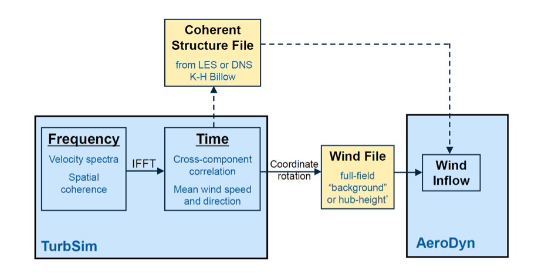

Introduction
============

TurbSim is a stochastic, full-field, turbulent-wind simulator. It uses a
statistical model (as opposed to a physics-based model) to numerically
simulate time series of three-component wind-speed vectors at points in
a two-dimensional vertical rectangular grid that is fixed in space.
TurbSim output can be used as input into InflowWind-based [1] codes such
as FAST [2] or MSC.ADAMS® [3]. InflowWind uses Taylor’s frozen
turbulence hypothesis to obtain local wind speeds, interpolating the
TurbSim-generated fields in both time and space.

Spectra of velocity components and spatial coherence are defined in the
frequency domain, and an inverse Fourier transform produces time series.
The underlying theory behind this method of simulating time series
assumes a stationary process. To simulate non-stationary components,
TurbSim—used with AeroDyn v13 [4]—can superimpose coherent turbulent
structures onto the time series it generates. The basic simulation
method is summarized in Figure 1.

   Figure 1. TurbSim simulation method: a transformation from the frequency
   domain to time domain producing wind output compatible with InflowWind;
   optional coherent structures are written to a separate file and
   superimposed in AeroDyn v13 (they require a full-field background wind
   file)

History
~~~~~~~
In 1988, Paul Veers of Sandia National Laboratories wrote a program
called SNLWIND [5] that could generate full-field turbulent wind for the
streamwise (*u*) component only. In 1992, Neil Kelley of the National
Renewable Energy Laboratory (NREL) added several spectral models to
SNLWIND and modified it to generate the *v* and *w* components [6].
SNLWIND-3D was the result. During the next five years NREL researchers
modified the program further, including adding the Kaimal and von Karman
spectral models specified by the International Electrotechnical
Commission (IEC). Gary Desroachers modified it to run on many different
platforms by including C-preprocessor directives for conditional
compilation. In 1997, Marshall Buhl added the ability to generate binary
files that are compatible with Garrad Hassan’s “GH Bladed” turbine
design code [7].

Both SNLWIND and SNLWIND-3D were written in FORTRAN 77 and required
recompilation for different grid densities and run lengths. This made
using and supporting the programs difficult.

In January 2000, Neil Kelley removed all of the spectral models except
the two defined by the IEC, and Marshall Buhl modernized the remaining
code by rewriting all but the Fast Fourier Transform (FFT) routines in
Fortran 95 and eliminating the C-preprocessor directives. Buhl’s changes
included using dynamic-memory allocation for the big arrays, which
eliminated the need to recompile for different grid sizes and run
lengths. He modified the input and output file format, streamlined
processes, and added the ability to generate hub-height files in AeroDyn
format. Because the changes were substantial, Buhl renamed the program
SNwind (Sandia/NREL Wind) [8].

In 2003, NREL researchers updated the code to add results from the Lamar
Low-Level Jet Project (LLLJP) and from the National Wind Technology
Center (NWTC) Long-Term Inflow and Structural Testing (LIST) project.
Bonnie Jonkman also added the spectral models from SNLWIND-3D that were
removed from SNwind, and she replaced the FORTRAN 77 FFT routines with
more modern routines from the Compaq Extended Math Library (CXML).
Jonkman made changes to the Cholesky factorization algorithm, which sped
up the code and allowed for a significant reduction in the memory
required to run the program. She eliminated the requirement that the
grid be an even number of points in each direction, and allowed the grid
height to be different from its width. After these enhancements were in
place, the code was modified to generate coherent structures with
realistic temporal and spatial scaling, and coherent turbulence
time-step files became another output option. The code was then renamed
TurbSim (turbulence simulator) because of its ability to generate
coherent turbulence.

In 2005, Bonnie Jonkman replaced the CXML FFT routines with routines
from FFTPACK [9] so that TurbSim could be compiled on the Intel® Visual
Fortran compiler. This made the code run much faster and also made it
more portable. In 2009, Jonkman updated algorithms in the code to enable
users to create much larger grids than were possible in earlier
versions.

In 2012, Levi Kilcher added a new spectral model (TIDAL) to extend
TurbSim’s use for marine and hydrokinetic (MHK) energy. This model
simulates turbulence in the water, and is *not* intended to be used for
wind simulation.

Neil Kelley has written a companion document, `Overview of the TurbSim
Stochastic Inflow Turbulence
Simulator <http://www.nrel.gov/docs/fy07osti/41137.pdf>`__ [10], which
discusses the development of TurbSim and includes some of the theory
behind that development.
